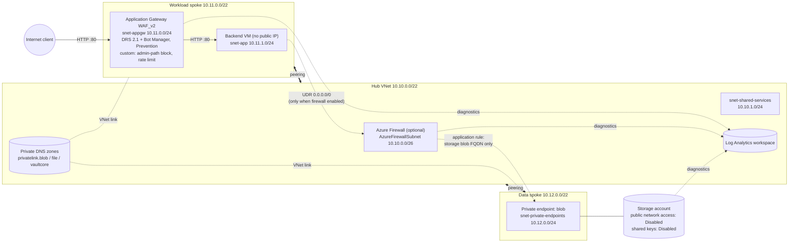

# azure-hub-spoke

Terraform reference implementation of an Azure hub-spoke network with a
private-endpoint-only data tier, an Application Gateway WAF_v2 front end,
centralised diagnostics and cost controls. It is delivered through a GitHub
Actions pipeline that plans on every pull request and applies only after an
approval gate, using OIDC federated credentials with no client secrets.

> **Deployment verification status: pending.**
> The configuration passes `terraform fmt`, `terraform validate`, offline
> `terraform test` runs against a mocked provider, `tflint` (azurerm ruleset)
> and a `trivy config` scan. It has **not yet been
> deployed** to an Azure subscription, so no claim below is backed by runtime
> evidence yet. [docs/VERIFY.md](docs/VERIFY.md) lists the checks that will
> produce that evidence, and the [verification status](#verification-status)
> table is filled in only from a real deployment.

## Architecture



Traffic model:

| Flow | Path | Control |
|---|---|---|
| Internet to app | Public IP, App Gateway (WAF), backend VM | WAF policy (Prevention), NSG on `snet-appgw` and `snet-app` |
| App to storage | VM, hub firewall, private endpoint | UDR, firewall application rule (FQDN), NSG on the endpoint subnet. **Exists only when the firewall is enabled.** |
| Spoke to spoke (anything else) | none | Peering is non-transitive; the firewall denies anything not explicitly allowed |
| Internet to storage | none | `publicNetworkAccess = Disabled`; the FQDN resolves to the private endpoint only inside linked VNets |
| Compute egress to Internet | none by default | `default_outbound_access_enabled = false`; via the firewall when enabled |

## What this repository demonstrates

| Capability | Where | How it is verified |
|---|---|---|
| Hub-spoke networking, peering, per-subnet NSGs with explicit deny, UDRs only with a firewall | [`modules/hub`](modules/hub), [`modules/spoke`](modules/spoke), [`envs/dev/main.tf`](envs/dev/main.tf) | VERIFY §1, §3, §4 |
| Private endpoint + centrally hosted Private DNS, no public data path | [`modules/private-endpoint`](modules/private-endpoint), [`envs/dev/data.tf`](envs/dev/data.tf) | VERIFY §2 |
| App Gateway WAF_v2: managed rule sets, custom rule, rate limiting | [`modules/app-gateway-waf`](modules/app-gateway-waf) | VERIFY §5 |
| Diagnostic settings on every resource that exposes categories | [`modules/monitoring`](modules/monitoring), [`envs/dev/monitoring.tf`](envs/dev/monitoring.tf) | VERIFY §6 |
| Terraform through CI/CD: plan on PR, approval-gated apply, OIDC | [`.github/workflows`](.github/workflows), [docs/deployment-identity.md](docs/deployment-identity.md) | VERIFY §7 |
| Cost control: optional firewall, autoscale from 0, log cap, budgets | [`envs/dev/cost.tf`](envs/dev/cost.tf), [cost section](#cost) | VERIFY §8 |

## Repository layout

```text
.
├── envs/dev/                    # composition: address plan, NSG/firewall rules, wiring
│   ├── main.tf                  # resource groups, hub, workload + data spokes
│   ├── data.tf                  # storage account + blob private endpoint
│   ├── workload.tf              # backend VM + Application Gateway WAF
│   ├── monitoring.tf            # Log Analytics + diagnostic settings targets
│   ├── cost.tf                  # per-resource-group budgets
│   ├── locals.tf                # naming convention, tags, address plan
│   ├── backend.tf               # azurerm backend (partial config, OIDC/Entra auth)
│   ├── tests/plan.tftest.hcl    # offline plan tests (mocked provider)
│   └── terraform.tfvars.example
├── modules/
│   ├── hub/                     # hub VNet, firewall (optional), Private DNS zones
│   ├── spoke/                   # spoke VNet, subnets, NSGs, UDRs, peering, DNS links
│   ├── private-endpoint/        # one endpoint + DNS zone group
│   ├── app-gateway-waf/         # WAF_v2 gateway + WAF policy
│   └── monitoring/              # workspace + diagnostic settings (category discovery)
├── .github/
│   ├── workflows/               # propose.yml, apply.yml, destroy.yml
│   ├── actions/terraform-init/  # setup-terraform + azure/login (OIDC) + backend init
│   └── scripts/plan-summary.sh  # plan summary + fingerprint
└── docs/
    ├── adr/                     # architecture decision records
    ├── deployment-identity.md   # identities, roles, one-time setup
    └── VERIFY.md                # post-deployment evidence checklist
```

Modules contain the mechanics. The policy (address plan, NSG rules, firewall
rules, WAF thresholds) lives in `envs/dev` so a reviewer can read it in one
place.

## Design decisions

Full reasoning in [docs/adr](docs/adr):

1. [Customer-managed hub-spoke over Virtual WAN](docs/adr/0001-hub-spoke-over-virtual-wan.md):
   explicit, reviewable routing and near-zero idle cost at two spokes.
2. [Azure Firewall optional, off by default](docs/adr/0002-azure-firewall-optional.md):
   it dominates cost. With it off, the spokes are isolated, which is the
   secure default and not a degraded mode.
3. [Private endpoints with central Private DNS](docs/adr/0003-private-endpoints-and-private-dns.md):
   zones in the hub, each spoke links itself, endpoint NSGs enforced.
4. [WAF_v2 in Prevention mode with custom rules](docs/adr/0004-waf-prevention-mode-with-custom-rules.md):
   DRS 2.1 + Bot Manager, an admin-path rule and a per-client rate limit.
5. [OIDC federated credentials, two identities](docs/adr/0005-oidc-federated-credentials.md):
   read-only for PRs, write only behind the environment gate.
6. [Propose, Gate, Commit](docs/adr/0006-plan-on-pr-apply-behind-approval.md):
   plan on PR, approval-gated apply that refuses to run if the plan changed
   after approval.

Other choices:

- **Naming:** `<type>-<workload>-<env>-<region>[-<role>]` with Cloud Adoption
  Framework abbreviations (`rg-hubspoke-dev-plc-hub`, `agw-hubspoke-dev-plc`).
  The storage account name gets a deterministic suffix derived from the
  subscription ID. All resources carry `workload`, `environment`, `owner`,
  `managed-by` and `repository` tags.
- **Region:** `polandcentral` by default (three availability zones). Zonal
  resources take `zones`; set `zones = []` in a region without zones.
- **Diagnostics:** the monitoring module discovers each resource's log and
  metric categories at plan time (`azurerm_monitor_diagnostic_categories`)
  and enables `allLogs` (or every category) plus all metrics. Application
  Gateway and Azure Firewall write to resource-specific tables.
- **Backend VM:** a burstable Ubuntu VM serving a static page through a
  hardened systemd unit (`DynamicUser`, `ProtectSystem=strict`), with no
  package downloads needed. It is the WAF backend and the in-VNet vantage
  point for verification, reached with `az vm run-command`. There is no
  public IP and no SSH rule.

## Pipeline: Propose, Gate, Commit

| Stage | Workflow / job | Identity | What happens |
|---|---|---|---|
| Propose | `propose.yml` / `static` | none | `fmt -check`, `init -backend=false`, `validate`, `terraform test` (mocked provider), `tflint` (azurerm ruleset), `trivy config` (pinned binary, checksum verified) |
| Propose | `propose.yml` / `plan` | plan (read-only) | Speculative plan (`-lock=false`), summary and full plan upserted as one PR comment |
| Gate | `apply.yml` / `plan` | plan (read-only) | Plan + fingerprint published to the run summary |
| Gate | `apply.yml` / `apply` | waits for `production` reviewers | Run pauses until approved |
| Commit | `apply.yml` / `apply` | apply (environment secret) | Re-plan under lock, compare fingerprint, apply the saved plan |
| Teardown | `destroy.yml` | plan, then apply | Typed confirmation, destroy plan, same gate and fingerprint check |

All third-party actions are pinned to commit SHAs, and Dependabot keeps them
and the provider current. State-changing workflows share one concurrency
group and are never cancelled midway.

## Deploy

Prerequisites: an Azure subscription you can dedicate to this (Owner for the
one-time setup), a GitHub repository, Terraform >= 1.9 locally.

1. **One-time Azure setup:** register resource providers, create the state
   storage account and the two OIDC identities with their roles. All
   commands are in [docs/deployment-identity.md](docs/deployment-identity.md).
2. **GitHub setup:** add the secrets and variables listed there, create
   the `production` environment with required reviewers and a `main`-only
   branch policy, and protect `main` (require the `propose` checks).
3. **Propose:** open a PR. Review the plan comment.
4. **Gate and Commit:** merge, open the `apply` run, read the plan in the run
   summary, approve the `production` deployment.
5. **Verify:** work through [docs/VERIFY.md](docs/VERIFY.md) and record results.
6. **Destroy:** run the `destroy` workflow (`destroy dev`) and approve it.

Local plan (optional, as yourself):

```bash
cd envs/dev
cp terraform.tfvars.example terraform.tfvars    # set owner, SSH key, emails
cp backend.hcl.example backend.hcl              # point at the state account
az login
terraform init -backend-config=backend.hcl
terraform plan
```

Validation without any Azure access:

```bash
terraform fmt -check -recursive
terraform -chdir=envs/dev init -backend=false
terraform -chdir=envs/dev validate
terraform -chdir=envs/dev test        # mocked provider, no credentials
tflint --init && tflint --recursive --config "$PWD/.tflint.hcl"
trivy config .
```

## Cost

Approximate pay-as-you-go list prices in USD, 730 hours/month, no
reservations, light test traffic. Prices vary by region (Poland Central is
usually slightly above US regions) and change over time. Check the
[Azure Pricing Calculator](https://azure.microsoft.com/pricing/calculator/)
for your region before deploying. These are estimates, not billed figures.

| Component | Pricing basis | ≈ USD / month |
|---|---|---:|
| **Application Gateway WAF_v2** | fixed ~USD 0.44/gateway-hour + capacity units (autoscale min 0, max 2) | **~325–345** |
| **Azure Firewall Standard** (`enable_firewall = true`) | ~USD 1.25/deployment-hour + USD 0.016/GB processed | **~915** |
| Azure Firewall Basic (alternative) | ~USD 0.395/deployment-hour + USD 0.065/GB | ~290 |
| Public IPs (Standard, static) | ~USD 3.65 each: 1 for App GW, +1 firewall (+1 management for Basic) | 4–11 |
| Private endpoint (blob) | ~USD 0.01/hour + USD 0.01/GB | ~7 |
| Private DNS zones (3) | USD 0.50/zone + queries | ~2 |
| Log Analytics | ~USD 2.3–3/GB ingested; 1 GB/day cap bounds it at ~USD 70–90 | typically 5–15 |
| Backend VM `Standard_B2ats_v2` + 30 GB Standard HDD | burstable, pay-as-you-go | ~8–10 |
| Storage account (LRS, near-empty), VNets, peering (USD 0.01/GB), NSGs, route tables, budgets | | < 2 |
| **Total, default (firewall off)** | | **~360–420** |
| **Total, firewall Standard on** | | **~1,280–1,350** |

App Gateway WAF_v2 and Azure Firewall make up roughly 85–95% of the bill.
Everything else together is a few tens of dollars.

**Deploy, verify, destroy.** The environment is meant to exist for hours,
not months. At ~USD 0.50/hour (default) or ~USD 1.80/hour (firewall
Standard), a four-hour verification session costs about USD 2 or USD 7.5.
Apply, run docs/VERIFY.md, export the evidence, then run `destroy`.

Cost controls built in:

- Azure Firewall off by default; Basic tier selectable.
- Application Gateway autoscale `min_capacity = 0`, `max_capacity = 2`.
- Log Analytics 1 GB/day ingestion cap, 30-day retention (included in price).
- Budgets on each resource group (USD 50 / 100 / 20 by default), alerting at
  50% actual and 100% forecast. They alert; they do not stop spend.
- LRS storage, a burstable VM, no Bastion, no DDoS Network Protection plan
  (~USD 2,900/month, see below).

## Security notes

Implemented:

- No public data path: storage has public network access and shared keys
  disabled, OAuth by default, TLS 1.2 minimum, infrastructure encryption,
  blob versioning and soft delete.
- Every subnet NSG ends in an explicit `Deny-All-Inbound`. The private
  endpoint subnet enforces its NSG (`NetworkSecurityGroupEnabled`).
- Compute subnets have default outbound access disabled. No VM has a public
  IP or an SSH/RDP rule.
- WAF in Prevention mode, request body enforcement, log scrubbing of
  `Authorization` and cookies.
- Log Analytics accepts Entra ID authentication only (local auth disabled).
- Pipeline: OIDC only, read/write identity split, write identity scoped to
  an approved environment, SHA-pinned actions, checksum-verified scanner,
  plan fingerprint between approval and apply.
- Accepted scanner findings are suppressed inline with their rationale
  (`#trivy:ignore:` in `envs/dev/data.tf` and `workload.tf`): CMK, GRS,
  classic queue logging, the trusted-services bypass, NIC-level NSG.

Known gaps, deliberately out of scope for this environment:

- **HTTP-only listener.** HTTPS needs a certificate in Key Vault and a
  managed identity on the gateway. The TLS 1.2+ policy is already set.
- **No DDoS Network Protection plan.** Infrastructure DDoS protection only.
  The plan is a tenant-level cost decision.
- **No VNet flow logs** (NSG flow logs are retired for new deployments). They
  are the next addition, with Traffic Analytics into the same workspace.
- **Platform-managed keys and LRS** for storage, which suit dev only.
- **No Azure Policy assignments.** Guardrails such as "deny public network
  access on storage" belong at management-group scope, outside this
  repository.
- **Public plan output.** On a public repository, PR plan comments show
  resource IDs, including the subscription ID. These are identifiers, not
  credentials, but a private repository is the better default for real
  workloads.

## Verification status

To be completed from a real deployment only, following
[docs/VERIFY.md](docs/VERIFY.md). Until then every row stays **Pending**.

| Claim | VERIFY section | Status | Evidence |
|---|---|---|---|
| Peerings `Connected`, no spoke-to-spoke peering | §1 | Pending | |
| Storage FQDN resolves to the private endpoint IP inside the spokes | §2a | Pending | |
| Storage unreachable from the Internet, even when authenticated | §2b | Pending | |
| Spokes isolated without firewall; routed through firewall when enabled | §3 | Pending | |
| NSG explicit deny effective; endpoint NSG enforced | §4 | Pending | |
| WAF blocks SQLi/XSS (DRS 2.1), admin path rule, rate-limit rule | §5 | Pending | |
| Diagnostic settings present and logs arriving | §6 | Pending | |
| Plan on PR, approval-gated apply, fingerprint check, gated destroy | §7 | Pending | |
| Budgets, autoscale bounds, log cap; actual cost of the verification window | §8 | Pending | |
